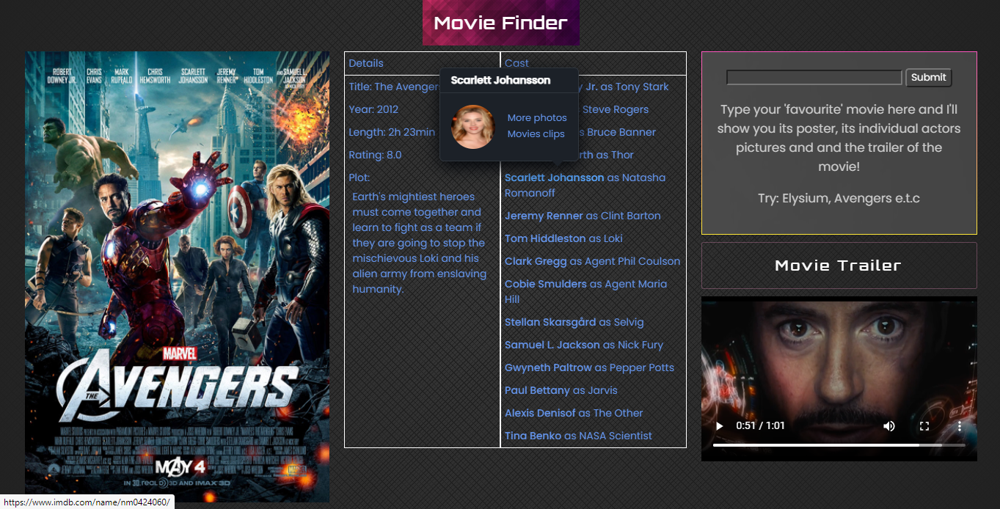
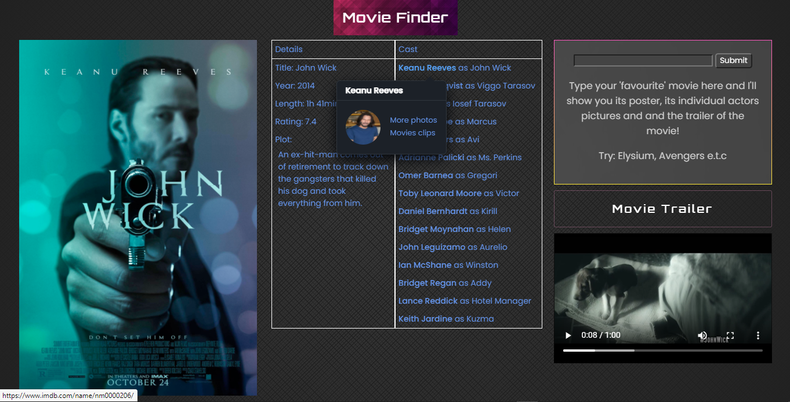

<h1 id="header" align="center"> 🎥 Movie Finder 🦾</h1>

<h4 align="center">Explore movies and recognize its actors easily!</h4>

<p align="center">A web app for exploring movies, watching their trailers and checking out its actors.</p>

**<p align="center">[movie.finder](https://danbamikiya.github.io/movie-finder/)</a></p>**

<p align="center"></p>

<details>
<summary>more</summary>
<br />
<p align="center"></p>
</details>

---

## ✨ Features

- **Movies Search** (Search up your fav movies)

- **Hovercard Info** (Hover on each actor's names to view their pic and info)

- **Movie Trailer** (Watch a trailer of the movie you searched)

## 🌴 Branches

- [`main`](https://github.com/danBamikiya/movie-finder/tree/main) - production ready code
- [`staging`](https://github.com/danBamikiya/movie-finder/tree/staging) - testing/development
- [`gh-pages`](https://github.com/danBamikiya/movie-finder/tree/gh-pages) - deployment of bundled app

## ⌛ Status

✅ **Early Development:** Start building a barebones version of the project (Movies Search). <br />
⛔︎ **Actor Face Recognition:** Work on recognizing actor's faces from the movie poster - _stopped_. See [#1](https://github.com/danBamikiya/movie-finder/issues/1). <br />
✅ **Hovercard Info:** Displaying actor profile images and info. <br />
✅ **TypeScript:** Converted codebase from JS to TS. <br />
✅ **Movie Trailer:** Trailer for searched movies. <br />
✅ **Migration:** Migrated from CSS to Sass. <br />
✅ **Caching:** In-Memory cache for storing searched movies, document fragments, API requests/responses, images. <br />
⌛️ **Local Storage:** Persisting cached data to local storage. <br />
⌛️ **Loading Status:** Displaying loading effects when movies are searched. <br />
⌛️ **Redesign/write:** Implementation of the 2nd re-design. See [ARCHITECTURE.md](https://github.com/danBamikiya/movie-finder/blob/main/ARCHITECTURE.md). <br />
⌛️ **Recommendation Engine:** Recommending movies to users. See [ARCHITECTURE.md](https://github.com/danBamikiya/movie-finder/blob/main/ARCHITECTURE.md). <br /><br />

## 📚 Tech Stack

This is currently a frontend focused app so everything is browser rendered.

#### 🎨 Frontend

Typescript . Sass . HTML (bundled with Webpack + Babel)

#### 💫 Hosting

Github Pages (currently)

#### 🚀 Continuous Deployment

Github Actions

## Commands

All commands are run from the root of the project, from a terminal:

| Command                     | Action                                                                                     |
| :-------------------------- | :----------------------------------------------------------------------------------------- |
| `npm install`               | Installs dependencies                                                                      |
| `npm run start`             | Starts local dev server at `localhost:8080`                                                |
| `npm run start:remote-dev`  | Starts local dev server at `localhost:8080` in a remote development environment eg: Gitpod |
| `npm run build`             | Build the production site to `./build/`                                                    |
| `npm run build:serve-local` | Build the production site to `./build/` and serve it locally                               |

## How To Run

#### Clone the app

```
git clone https://github.com/danBamikiya/movie-finder.git
```

#### Navigate to the cloned directory

```
cd movie-finder
```

#### Install dependencies

```
npm i
```

#### Add personal RapidAPI token (free)
We recommend setting this up when running the project locally, as we use the RapidAPI to fetch movies data.
>   -  [Sign up](https://rapidapi.com/signup) to create a RapidAPI account and [follow these steps](https://docs.rapidapi.com/docs/keys) to get a RapidAPI token
>   -  In local repo root directory: Make a copy of `.env.example` and name it `.env`
>   -  Copy & paste your new RapidAPI token into .env
```
// .env Example (an invalid key):
RAPID_API_KEY=K6NUTARFJZJCIXHF1F1E1YGJZ8RQ29BE4U
```

#### Quick Start

- To run the development server:

```
npm run start
```

- To build the app:

```
npm run build
```

- To build and serve the production build locally:

```
npm run build:serve-local
```
